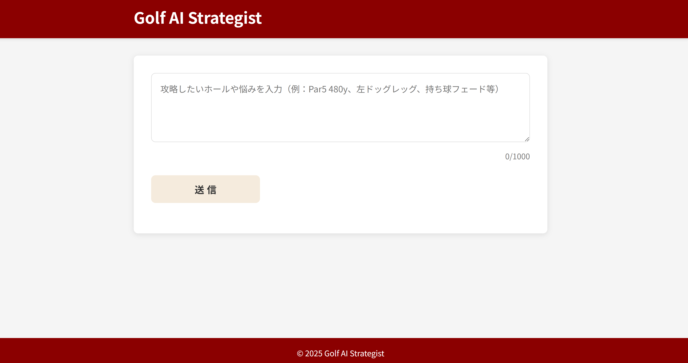
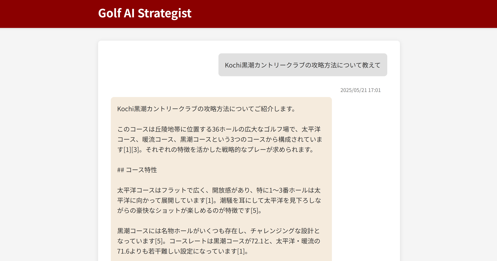

# Golf AI Strategist

## 概要

Golf AI Strategistは、ゴルフ部の監督と選手が特定コースの攻略プランを素早く取得できるWebアプリケーションです。ホール条件を入力するだけで、生成AIが最適な攻略プランを1分以内に提案します。

## 特徴

- ✅ **簡単入力**: ホール情報や悩みを自由記述で入力するだけ
- ✅ **高速レスポンス**: 最適な攻略プランを1分以内に生成
- ✅ **詳細な提案**: ティーショット、セカンド、グリーン周りの狙いどころを日本語で提示
- ✅ **シンプルなUI**: 入力と回答の2画面だけのシンプル設計
- ✅ **チャット形式表示**: 質問（右側）と回答（左側）を明確に区別
- ✅ **アクセシビリティ対応**: WCAG AA準拠、スクリーンリーダー対応
- ✅ **レスポンシブデザイン**: スマートフォンからデスクトップまで対応

## スクリーンショット

### 入力画面

ボルドー色のヘッダーとフッター、中央に入力フォームがあり、ベージュ色の送信ボタンが特徴です。

### 回答画面

右側にグレーの背景で質問、左側にベージュの背景で回答が表示されます。質問の下には日時が表示されます。

## 技術スタック

- **バックエンド**: 
  - Python 3.10.16
  - Flask 3.x (Blueprint)
  - Flask-Session
  - Perplexity API

- **フロントエンド**:
  - HTML5
  - CSS3
  - JavaScript (Vanilla)

- **インフラ**:
  - Render (1 vCPU / 512 MB)
  - GitHub Actions (CI/CD)

- **セキュリティ**:
  - CSRF対策
  - Content Security Policy (CSP)
  - HTTPS強制

## インストール方法

### 前提条件
- Python 3.10.16
- pip (Pythonパッケージマネージャー)
- Perplexity APIキー

### 手順

1. リポジトリをクローン

```bash
git clone https://github.com/Codeissei/golf-ai-strategist.git
cd golf-ai-strategist
```

2. 仮想環境を作成して有効化

```bash
# Windows
python -m venv venv
venv\Scripts\activate

# macOS/Linux
python -m venv venv
source venv/bin/activate
```

3. 依存パッケージをインストール

```bash
pip install -r requirements.txt
```

4. 環境変数の設定

```bash
cp .env.example .env
```

`.env`ファイルを編集して、以下の項目を設定します：

```
SECRET_KEY=あなたの秘密鍵（任意の文字列）
PERPLEXITY_API_KEY=あなたのPerplexity APIキー
```

5. アプリケーションの起動

```bash
flask run
```

6. ブラウザで http://localhost:5000 にアクセス

## Perplexity APIキーの取得方法

1. [Perplexity AI](https://www.perplexity.ai/)にアカウントを作成
2. APIキーを発行（詳細は[Perplexity APIドキュメント](https://docs.perplexity.ai/)を参照）

## デプロイ方法

### Renderへのデプロイ

1. [Render](https://render.com/)にアカウントを作成
2. 新しいWeb Serviceを作成
3. GitHubリポジトリを連携
4. 以下の設定を行う：
   - **Environment**: Python
   - **Build Command**: `pip install -r requirements.txt`
   - **Start Command**: `gunicorn run:app`
   - **環境変数**: `.env`ファイルの内容を環境変数として設定

## ライセンス

このプロジェクトは[MITライセンス](LICENSE)の下で公開されています。
